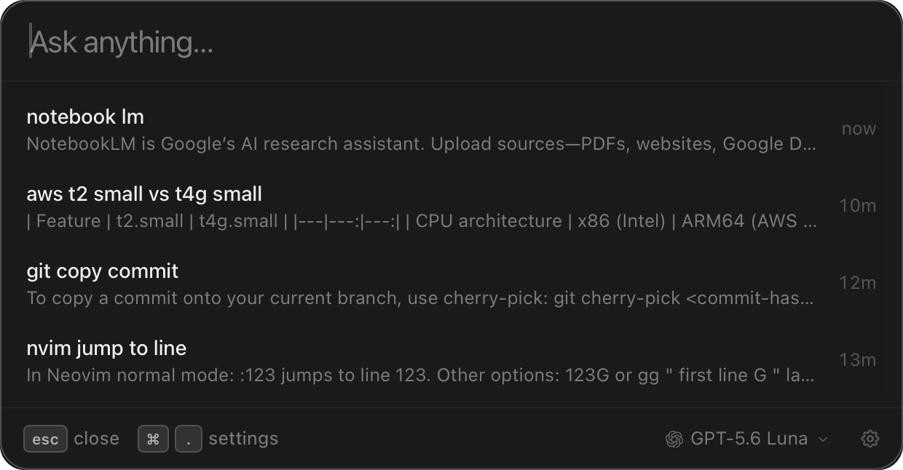

# PingAsk

A macOS Spotlight-style panel for quickly asking a question. Press shortcut, type question, get an answer, follow up, or browse threads like a cheatsheet.

Local, no backend or telemetry. Use your own API keys or connect your ChatGPT/Claude subscription. Supports OpenAI, Anthropic, OpenRouter and Ollama.

## License

MIT
